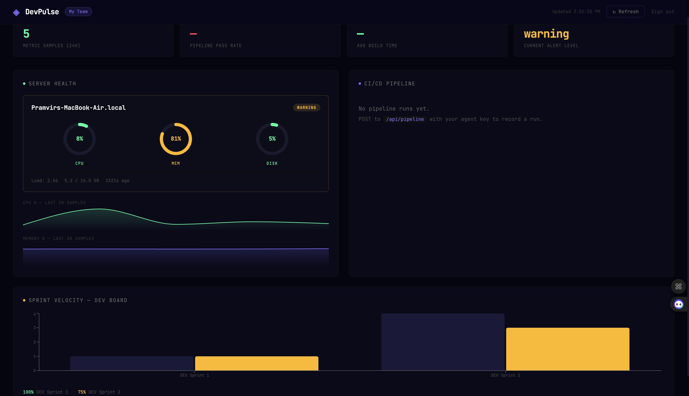

# DevPulse

**Open-source developer team health monitoring platform.**

DevPulse gives engineering teams a single dashboard to monitor server health, CI/CD pipeline status, and sprint velocity — without paying $500/month for enterprise tools.


---
## Screnshot

## The problem

Small engineering teams have no unified view of their operational health. They check Jenkins separately, GitHub separately, Jira separately — and by the time they notice a problem, it's already affecting users.

DevPulse connects all three into one self-hosted dashboard.

---

## Architecture

```
Python CLI Agent  ──►  Node.js REST API  ──►  React Dashboard
(runs on servers      (Express + MongoDB)      (live metrics,
 via cron, 5min)       OWASP hardened           pipeline status,
                                                sprint velocity)
CI/CD webhooks ──────────────────────────►
(Jenkins / GitHub Actions)
```

---

## Tech stack

| Layer | Technology |
|---|---|
| Backend API | Node.js, Express, MongoDB, Mongoose |
| Authentication | JWT + bcrypt-hashed agent keys |
| Security | Helmet.js, rate limiting, Joi validation (OWASP Top 10) |
| CLI Agent | Python 3, psutil, requests |
| Frontend | React, Recharts |
| CI/CD | GitHub Actions + Jenkins |
| Container | Docker, Docker Compose |
| Scheduling | cron (agent) |

---

## Quick start (local)

### Prerequisites
- Node.js 18+
- Docker & Docker Compose
- Python 3.8+

### 1. Clone and start services

```bash
git clone https://github.com/YOUR_USERNAME/devpulse.git
cd devpulse
docker compose up -d
```

MongoDB runs on port 27017, the API on port 5000, Mongo Express (DB browser) on port 8081.

### 2. Create your first team

```bash
curl -X POST http://localhost:5000/api/teams \
  -H "Content-Type: application/json" \
  -d '{"name": "My Team", "slug": "my-team"}'
```

**Save the `agentKey` from the response — it is shown only once.**

### 3. Configure and run the agent

```bash
cd agent
cp .env.example .env
# Edit .env — paste your agentKey and team slug

pip install -r requirements.txt
python3 agent.py
```

### 4. Schedule the agent with cron

```bash
# Run every 5 minutes
crontab -e

*/5 * * * * /usr/bin/python3 /path/to/devpulse/agent/agent.py >> /var/log/devpulse-agent.log 2>&1
```

### 5. Login to the dashboard API

```bash
curl -X POST http://localhost:5000/api/auth/login \
  -H "Content-Type: application/json" \
  -d '{"teamSlug": "my-team", "agentKey": "YOUR_KEY"}'
```

Use the returned JWT as `Authorization: Bearer <token>` for all dashboard endpoints.

---

## API reference

| Method | Endpoint | Auth | Description |
|---|---|---|---|
| GET | `/api/health` | None | Server health check |
| POST | `/api/auth/login` | None | Get JWT for dashboard |
| POST | `/api/teams` | None | Create a team |
| GET | `/api/teams/:id` | JWT | Get team details |
| POST | `/api/metrics` | Agent key | Submit system metrics |
| GET | `/api/metrics/:teamId` | JWT | Last 24h of metrics |
| GET | `/api/metrics/:teamId/summary` | JWT | Avg/max stats (1hr) |
| POST | `/api/pipeline` | Agent key | Submit pipeline run result |
| GET | `/api/pipeline/:teamId` | JWT | Last 50 pipeline runs |
| GET | `/api/pipeline/:teamId/stats` | JWT | 30-day daily stats |

---

## CI/CD pipeline

Every push triggers:

```
Lint → Test (with coverage) → Security audit → Docker build → Smoke test
```

Merge to `main` additionally triggers the CD pipeline with optional VPS deploy.

See `.github/workflows/` and `Jenkinsfile` for full configuration.

---

## Security

DevPulse is built with OWASP Top 10 in mind:

- **A01 Broken Access Control** — agents and dashboard users have separate auth. Principle of least privilege enforced.
- **A03 Injection** — all inputs validated with Joi before touching MongoDB. No raw query construction.
- **A05 Misconfiguration** — Helmet.js sets 11 security headers. Non-root Docker user. No stack traces in production.
- **A07 Auth Failures** — bcrypt for key hashing, rate limiting on auth routes (10 req/15min), JWT expiry.

---

## Running tests

```bash
cd server
npm test               # Run all tests with coverage
npm run test:watch     # Watch mode during development
npm run lint           # ESLint check
```

---

## Project structure

```
devpulse/
├── .github/workflows/    # GitHub Actions CI + CD
├── agent/                # Python CLI agent
│   ├── agent.py
│   └── requirements.txt
├── server/               # Node.js API
│   ├── src/
│   │   ├── app.js        # Express app + middleware
│   │   ├── index.js      # Entry point
│   │   ├── config/       # DB connection
│   │   ├── controllers/  # Business logic
│   │   ├── middleware/   # Auth, validation, errors
│   │   ├── models/       # Mongoose schemas
│   │   └── routes/       # Express routers
│   ├── tests/            # Integration tests
│   └── Dockerfile
├── client/               # React dashboard (Sprint 3)
├── scripts/              # Bash deploy scripts
├── docker-compose.yml
└── Jenkinsfile
```

---

## Roadmap

- [x] Sprint 1 — Core API, auth, agent, CI pipeline
- [ ] Sprint 2 — Alert engine (Slack webhooks), OWASP hardening pass
- [ ] Sprint 3 — React dashboard (metrics charts, pipeline view)
- [ ] Sprint 4 — Jira API integration for sprint velocity tracking
- [ ] Sprint 5 — Multi-server support, agent auto-discovery

---

## Contributing

1. Fork the repo
2. Create a feature branch: `git checkout -b feat/your-feature`
3. Run tests: `npm test`
4. Open a PR — CI runs automatically

---

## License

MIT — use this freely, including commercially.
